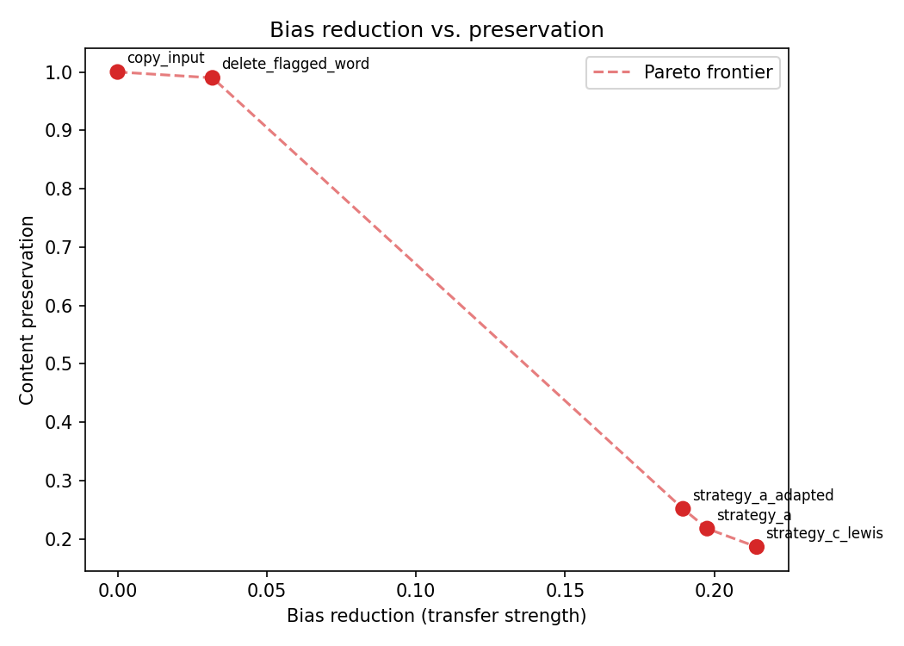

# biasneut — Lexical Political Bias Detection & Neutralization in News

A **detect-then-edit** system that finds sentence-level *lexical* political
bias in news text (loaded words, slanted verbs, framing adjectives) and
rewrites the flagged span into neutral language. The whole pipeline trains
on free-tier compute (one Kaggle T4). It is evaluated on the standard
style-transfer triad (**bias reduction × meaning preservation × fluency**)
against trivial baselines, with significance testing.

It adapts the modular *localize-then-edit* design of Pryzant et al. (2020),
*Automatically Neutralizing Subjective Bias in Text*, to news. The design
document is [`docs/proposal.md`](docs/proposal.md), and `§` references
throughout the code point into it.

**Deliverables**

- `biasneut`, a Python package covering every stage: data loading with
  leakage-safe splits, a dual-head bias detector, a seq2seq span editor
  trained under three data strategies, baselines, and the evaluation harness.
- A self-contained [Kaggle notebook](notebooks/kaggle_pipeline.ipynb) that
  runs the full pipeline end to end on a single T4 (~2.5 h).
- Command-line scripts for each stage, config files, and 113 tests.
- Full-scale experiment results in [`results/`](results/).
- Weights & Biases tracking for every training, evaluation and inference run.

---

## Architecture

```
STAGE 1 — Detector (biasneut.detector)          STAGE 2 — Editor (biasneut.editor)
  RoBERTa-scale encoder + 2 heads:                 t5-small seq2seq over span-marked
   • sentence head: biased / neutral               input (<bias> … </bias>), with an
   • token head: BIO tags of biased span(s)        optional decode-time copy bias.
  trained on BABE (sentence labels) +              Trained under three strategies for
  BASIL (lexical spans)                            where the neutral target comes from:
        │ predicted span                            A. WNC transfer (+ in-domain adaptation)
        └───────────────────────────────────►       B. LLM-synthesized pseudo-parallel pairs
                                                     C. unsupervised mask-and-infill / LEWIS-lite
```

`biasneut.pipeline.BiasNeutralizationPipeline` wires the stages together:
sentences the detector doesn't flag pass through unchanged. `biasneut.eval`
scores the outputs against `copy_input` and `delete_flagged_word` baselines.
Bias is scored by an *independent* detector instance that never sees
training-time filtering (§4.3/§6.1).

## Repository layout

```
src/biasneut/
  common/     config (dataclass + YAML), checkpoint/resume, precision/memory helpers,
              seeding, logging, W&B tracking
  data/       BABE / BASIL / WNC loaders, leakage-safe splitting, collation,
              Strategy-B pseudo-parallel generation + §4.3 filters
  detector/   dual-head model, training loop, inference wrapper, span metrics
  editor/     span marking, copy-bias decoding, seq2seq editor, one module per
              strategy (A/B/C), QLoRA decoder arm
  baselines/  copy-input, delete-flagged-word
  eval/       transfer strength, preservation, fluency, lexicon features,
              significance tests, Pareto frontier, full harness
  pipeline.py end-to-end detect-then-edit inference
scripts/      one CLI per stage (prepare data, train detector/editor, generate
              pseudo-parallel data, run pipeline, evaluate)
configs/      YAML configs for the detector, each editor strategy, and evaluation
notebooks/    kaggle_pipeline.ipynb — the full experiment, reproducible on Kaggle
data/lexicons Recasens et al. (2013) bias lexicons as released by Pryzant et al. (MIT)
results/      final evaluation report, per-system summaries, significance, Pareto plot
docs/         project proposal / design document
tests/        unit tests + integration tests (small real models and data)
```

## Setup

```bash
uv venv --python 3.12 .venv
uv pip install -e ".[dev]"      # extras: "llm" (Strategy B generation), "qlora" (QLoRA arm)
```

Tracking is on by default. Set `WANDB_API_KEY`, or set `BIASNEUT_WANDB=0` to
run untracked (see [Experiment tracking](#experiment-tracking)).

## Data

| Dataset | Role | How it's obtained |
|---|---|---|
| **BABE** (3,121 sentences) | sentence-level bias labels + biased words | HF Hub `mediabiasgroup/BABE`, automatic |
| **BASIL** (7,984 sentences, 100 stories × 3 outlets) | lexical-bias spans | cloned from `launchnlp/BASIL` automatically (tarball fallback if `git clone` is blocked) |
| **WNC** (53,803 train pairs) | editor pretraining (Strategy A) | download once (below) |
| **Bias lexicons** | lexicon component of the aggregate bias score | shipped in `data/lexicons/` |

```bash
mkdir -p data && curl -L https://nlp.stanford.edu/projects/bias/bias_data.zip -o data/bias_data.zip \
  && unzip -q data/bias_data.zip -d data && rm data/bias_data.zip     # -> data/bias_data/WNC
```

Splits are grouped by story and outlet, so no story appears on both sides of
a split boundary (§6.5; enforced by `assert_no_leakage`).

## Running

### Full experiment on Kaggle (recommended)

Upload [`notebooks/kaggle_pipeline.ipynb`](notebooks/kaggle_pipeline.ipynb)
with **Internet on** and a **T4 GPU**. Attach a `WANDB_API_KEY` secret. For
Strategy B, also attach `GEMINI_API_KEY` or `ANTHROPIC_API_KEY`.

The notebook rebuilds the package from source (one `%%writefile` cell per
module) and then:
1. Runs a one-minute sanity check with tiny models.
2. Acquires the data and builds the splits.
3. Trains both detectors.
4. Trains every editor strategy.
5. Runs the baselines and the full evaluation.
6. Runs an inference demo.

### Command line

```bash
python scripts/prepare_data.py --cache-dir data_cache

# Stage 1: a pipeline detector, plus an independent instance reserved for evaluation
python scripts/train_detector.py --cache-dir data_cache --config configs/detector.yaml
python scripts/train_detector.py --cache-dir data_cache --config configs/detector.yaml \
    --set output_dir=runs/detector_eval_independent --seed 1337

# Stage 2: one strategy at a time
python scripts/train_editor.py --strategy a --cache-dir data_cache --config configs/editor_strategy_a.yaml
python scripts/generate_pseudo_parallel.py --cache-dir data_cache \
    --detector-dir runs/detector_eval_independent          # add --dry-run to test without an API key
python scripts/train_editor.py --strategy b --config configs/editor_strategy_b.yaml \
    --pseudo-parallel-path runs/pseudo_parallel_filtered.json
python scripts/train_editor.py --strategy c --arm lewis --config configs/editor_strategy_c.yaml \
    --detector-dir runs/detector

# Inference
python scripts/run_pipeline.py --detector-dir runs/detector --editor-dir runs/editor_strategy_a \
    --sentence "The corrupt regime brutally cracked down on peaceful protesters."

# Evaluation: triad + baselines + Pareto + significance
python scripts/run_evaluation.py --cache-dir data_cache \
    --pipeline-detector-dir runs/detector --independent-detector-dir runs/detector_eval_independent \
    --editor-dir runs/editor_strategy_a
```

`--set key=value` overrides any config field, including nested ones, e.g.
`--set compute.mixed_precision=fp16`.

## Experiment tracking

Every run logs to Weights & Biases (project `biasneut`) through
`biasneut.common.tracking`. Tracking is wired into the choke points, so
callers can't forget it:

| Where | What's logged |
|---|---|
| detector training | config + data sizes, per-step loss/lr, per-epoch dev sentence/span P/R/F1 |
| editor training (all strategies) | config + data sizes, per-step loss/lr, per-epoch dev loss |
| Strategy B generation | pairs generated/kept overall and per LLM, sample of kept pairs |
| evaluation | per-system metric table, `n_degenerate` (outputs with non-finite perplexity), significance table, Pareto plot |
| inference | input/output table, counts flagged / changed / empty |

- Missing credentials raise an error before training starts, so a run can
  never silently go untracked. `BIASNEUT_WANDB=0` is the explicit off switch;
  the tests set it automatically.
- `BIASNEUT_WANDB_GROUP` groups all runs from one pipeline execution. The
  notebook sets it for you.
- A run that raises an exception is tagged `failed`.

## Results

Full-scale run: BABE+BASIL detectors, WNC-pretrained editors, one Kaggle T4.
The evaluation set is the held-out BABE test split. The same experiment was
reproduced on a second environment (Colab T4) with consistent numbers. Raw
outputs are in [`results/`](results/).

**Stage 1 — detector** (dev set, final epoch)

| Instance | Sentence F1 | Sentence acc. | Span P | Span R | Span F1 |
|---|---|---|---|---|---|
| pipeline detector | 0.689 | 0.886 | 0.500 | 0.268 | 0.349 |
| independent (eval) detector, seed 1337 | 0.682 | 0.891 | 0.500 | 0.249 | 0.333 |

**Stage 2 — full system vs. baselines** ([`results/report.md`](results/report.md))

| System | Frac. neutral ↑ | Mean bias-prob drop ↑ | SBERT cos ↑ | BERTScore F1 ↑ | SARI ↑ | BLEU | P(grammatical) ↑ |
|---|---|---|---|---|---|---|---|
| copy_input (baseline) | 0.603 | 0.000 | 1.000 | 1.000 | 100.0 | 100.0 | 0.906 |
| delete_flagged_word (baseline) | 0.667 | 0.032 | 0.990 | 0.993 | 85.8 | 97.4 | 0.860 |
| Strategy A — WNC transfer | 0.923 | 0.198 | 0.218 | 0.805 | 7.4 | 0.4 | 0.300 |
| Strategy A — + in-domain adaptation | 0.907 | 0.189 | 0.251 | 0.813 | 9.0 | 0.4 | 0.238 |
| Strategy C — LEWIS-lite | **0.974** | **0.214** | 0.186 | 0.812 | **12.1** | 0.0 | **0.390** |

- **Bias reduction is large and significant.** Every trained editor cuts
  detected bias far more than either baseline (McNemar vs. `copy_input`,
  p < 10⁻⁶ for all three). The fully unsupervised Strategy C does best on
  transfer strength and SARI.
- **Meaning preservation is the weak axis.** SBERT similarity to the source
  is 0.19–0.25, against 0.99 for the delete-word baseline (95% bootstrap CIs:
  A 0.200–0.235, A-adapted 0.232–0.272, C 0.169–0.202).

  

  The Pareto plot shows the editors trading preservation for transfer strength.
  This is exactly the "mangle the text to win the bias metric" failure mode
  the proposal's §9 warns about, which is why the triad is reported jointly
  rather than as one score.
- **In-domain adaptation helps, reproducibly.** Continuing Strategy A on
  in-domain news pairs raised SARI by 18% and 21% in two independent runs at
  different adaptation scales (164 pairs / 4 epochs and 1,055 pairs / 8 epochs).
  BERTScore also improved. Scaling the adaptation data 6.4× did not scale the
  gain, which points to the *kind* of supervision mattering more than its quantity.
- **Generation on the T4 is unstable.** A minority of editor outputs on T4
  hardware collapse to empty or single-token strings, so aggregate
  perplexity is non-finite (the `inf` in `results/report.md`).
  - Eight candidate causes were tested and ruled out, each with a dedicated
    experiment: copy-bias strength, repetition guard, batch padding,
    `transformers` version, detector CPU/GPU drift, train/eval mode,
    gradient checkpointing, and cache config.
  - The same checkpoints run on a different GPU produced no degenerate
    outputs and clean, targeted edits, e.g. *"our bloated, draconian justice
    system"* → *"our justice system"*.
  - The evaluation now reports this directly as `n_degenerate` per system.

## Design decisions

- **Pryzant off-the-shelf baseline.** The 2019 release pins
  `pytorch_pretrained_bert==0.3.0` / `torch==1.1.0`. Strategy A's
  WNC-pretrain-only checkpoint stands in for it: same question ("how far does
  pure Wikipedia transfer get on news?"), same modern architecture as every
  other arm.
- **Copy bias, not a pointer-generator.** `editor/constrained_decoding.py`
  boosts the logits of subword tokens from the sentence's unflagged region at
  every decoding step. It is a soft nudge toward reusing source vocabulary,
  not Pryzant's trained copy mechanism.
- **Strategy C uses detector-guided masking.** Mask positions come from the
  Stage-1 span detector rather than from where two MLMs disagree (Masker).
  LEWIS-lite reuses the same detector as its tagger instead of training a
  second model.
- **Lexical spans only.** BASIL's informational-bias annotations are read but
  discarded. A copy-heavy editor is the wrong tool for that half of the problem (§2.1).
- **Strategy B on a free-tier LLM.**
  - `GeminiClient` paces calls to ~10/min and retries 429/5xx errors with backoff.
  - Generation drops a client after 5 consecutive failures, so an exhausted
    daily quota can't stall a run.
  - The notebook samples 450 source sentences.
  - The editor continues from the WNC checkpoint with A-adapted's config, so
    B and A-adapted differ only in their adaptation data.
- **Circularity mitigations (§4.3).** Synthetic pairs must lower the
  *independent* detector's bias score and clear an SBERT similarity floor
  before any training. A random sample is exported for human spot-checking.
  Synthetic data never enters the test split.
- **Kaggle secrets are not environment variables.** The notebook reads them
  through `kaggle_secrets.UserSecretsClient` (or Colab's `userdata`).

## Scope and limitations

- **Reported experiments cover Strategies A, A-adapted and C.** Strategy B
  (LLM-synthesized pairs) and the QLoRA instruction-tuned decoder arm are
  fully implemented and tested. They weren't part of the reported runs:
  Strategy B needs paid or rate-limited LLM API access, and the QLoRA arm is
  an optional extension (§7.3). Both run from the same notebook when enabled.
- Results are from a single seed per configuration. The human spot-check of
  synthetic pairs applies only to Strategy B.
- Meaning preservation of the trained editors, together with the T4-specific
  generation instability described above, is the main open problem. Greedy
  decoding (`num_beams=1`) avoids beam search's amplification of
  floating-point differences and is the obvious next thing to try.

## Tests

```bash
pytest -m "not integration"   # 105 fast tests, no network
pytest                        # + 8 integration tests using small real models and data
```

The tests cover:
- BIO tagging and alignment, span marking, leakage-safe splitting
- detector and editor metrics, significance tests, Pareto frontiers
- checkpoint save/resume, config (de)serialization
- Strategy B generation, rate-limit retries and circuit-breaking
- the W&B tracking layer

## Project history

An earlier version of this repository adapted Pryzant et al.'s *concurrent*
model directly and shipped a Streamlit demo. It is preserved at the git tag
[`legacy-pryzant-adaptation`](https://github.com/shadowPunch/Ground-Truth-inference/tree/legacy-pryzant-adaptation), along
with its [video presentation](https://drive.google.com/drive/folders/1pi5l832wiVKQa8GRIOSAmEoMdDNGdayc).
This version replaces it with the modular detect-then-edit design from
[`docs/proposal.md`](docs/proposal.md).

## References

- Pryzant et al. (2020). *Automatically Neutralizing Subjective Bias in Text.* AAAI.
- Spinde et al. (2021). *Neural Media Bias Detection Using Distant Supervision With BABE.* Findings of EMNLP.
- Fan et al. (2019). *In Plain Sight: Media Bias Through the Lens of Factual Reporting* (BASIL). EMNLP.
- Recasens et al. (2013). *Linguistic Models for Analyzing and Detecting Biased Language.* ACL.
- Reid & Zhong (2021). *LEWIS: Levenshtein Editing for Unsupervised Text Style Transfer.* Findings of ACL.

BABE and BASIL are used under their research licenses. The bias lexicons in
`data/lexicons/` are redistributed under Pryzant et al.'s MIT license (see
`data/lexicons/LICENSE`).
